# 📚 BookForward — *Give Every Book Another Chapter.*

A marketplace where students buy and sell **pre-owned books** — school and college textbooks, exam-prep, programming and general reading — and find the **nearest listings first**.

**Live demo:** https://bookforward-1.onrender.com
*(hosted on a free tier, so the first load after a quiet period can take about a minute while the server wakes up)*

> B.Tech major project · Java 21 · Spring Boot · PostgreSQL · plain HTML/CSS/JavaScript

---

## ✨ What you can do

| For buyers | For sellers | For everyone |
|---|---|---|
| Search by title, author, subject, city | List a book with only a **front cover photo required** (up to 5 photos) | Real-time chat between buyer and seller |
| **Near me** — nearest books first, remembered for next visit | One-tap **Detect my location** fills area, city, state and pincode | Notifications for requests and orders |
| Filter by academic level, subject, board, condition, price | Optional author, publisher, ISBN and board | Saved books and a simple profile |
| Send a purchase request, track the order | Choose a subject or type your own with **Other** | Works on phone and PC |

---

## 🖼️ Screenshots

> The screenshots below were captured from the real frontend running against sample demo data, so every screen looks populated.

### Home
The 3D book shelf, subject chips, latest listings and a four-step "How it works".

| PC | Phone |
|---|---|
| 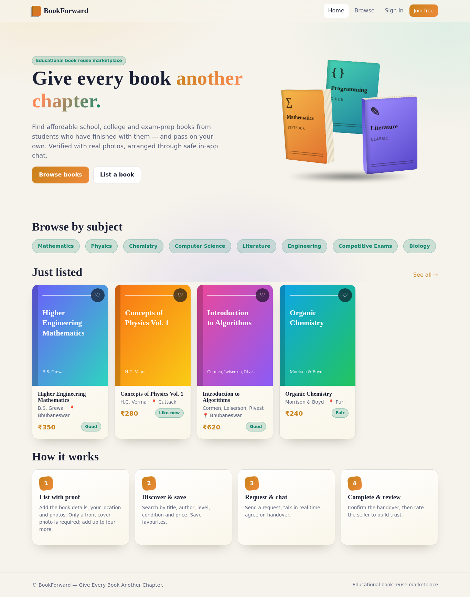 |  |

### Browse with nearby-first results
Books in your own city come first. Use **Near me**, or type another city to check what's available elsewhere. Typing in the search box ignores location and searches everywhere.

| PC | Phone |
|---|---|
| 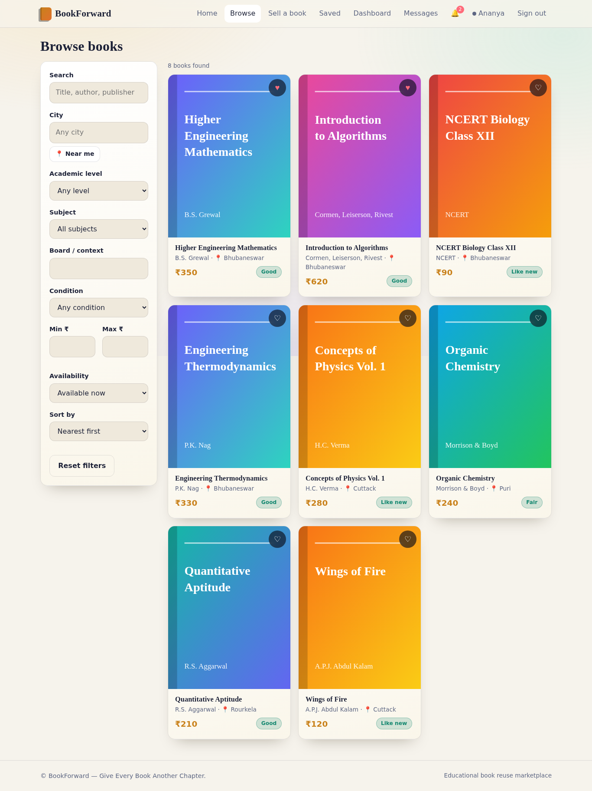 | 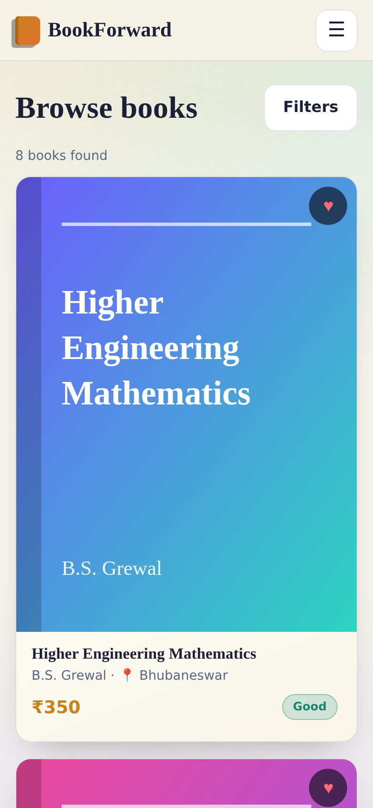 |

### Book details
Photo gallery, condition, price, location (area and city), seller rating and reviews. The seller's exact flat or house number stays private.

| PC | Phone |
|---|---|
|  |  |

### Sell a book, with location detection
**Detect my location** reads the browser location and fills area, city, state and pincode through OpenStreetMap. The seller then only adds a flat or house number. Only the front cover photo is mandatory.

| PC | Phone |
|---|---|
| 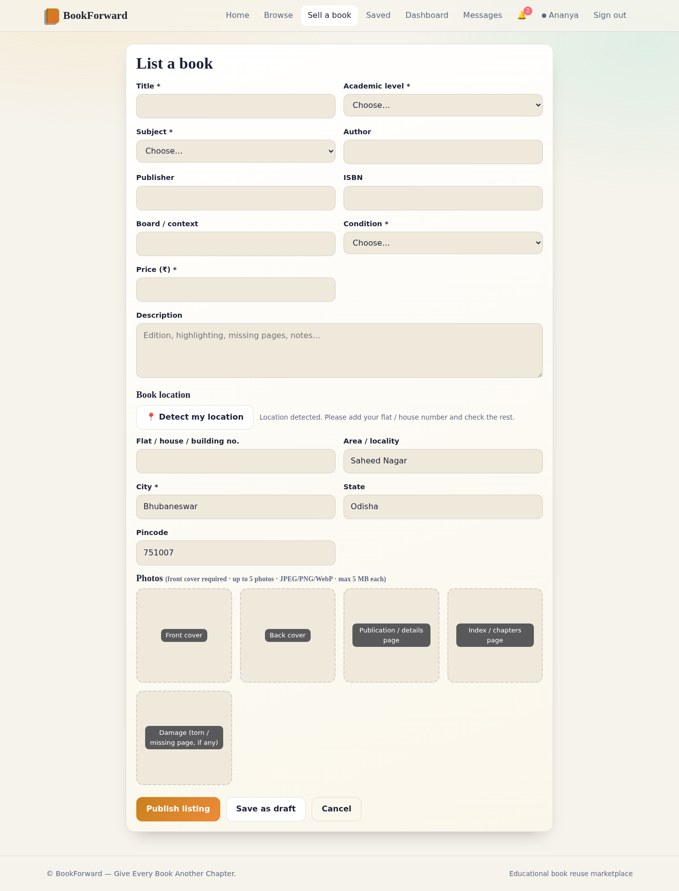 | 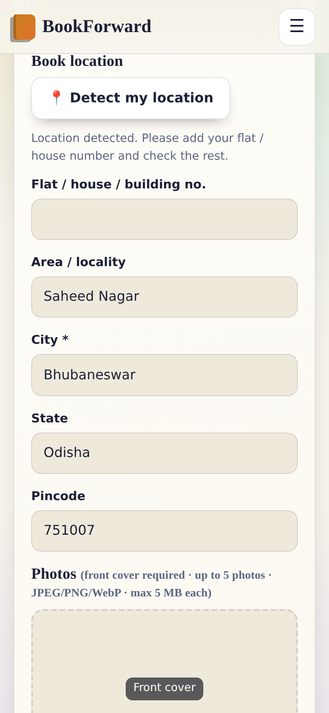 |

### Sign in and create an account

| PC | Phone |
|---|---|
| 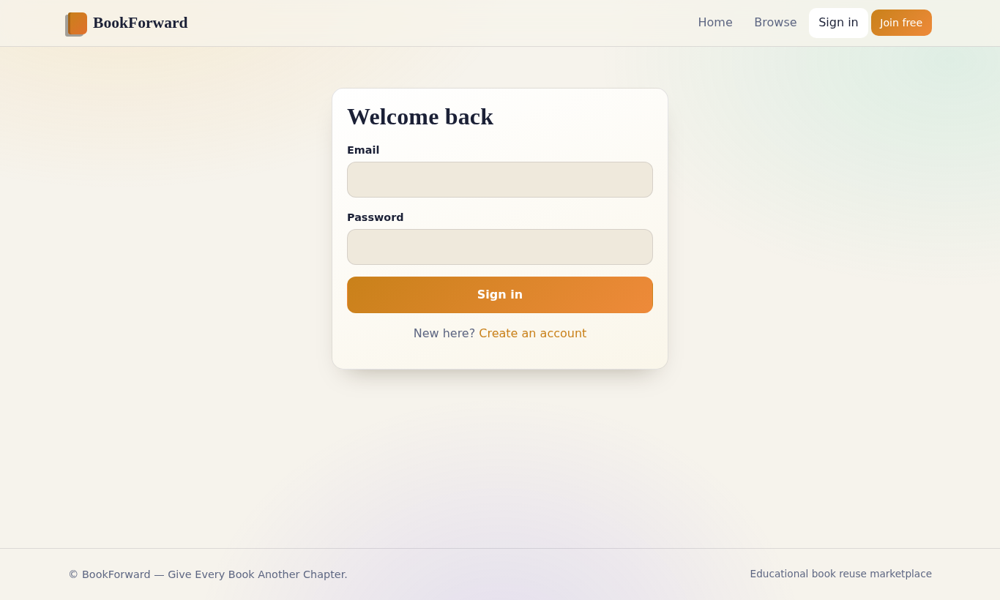 | 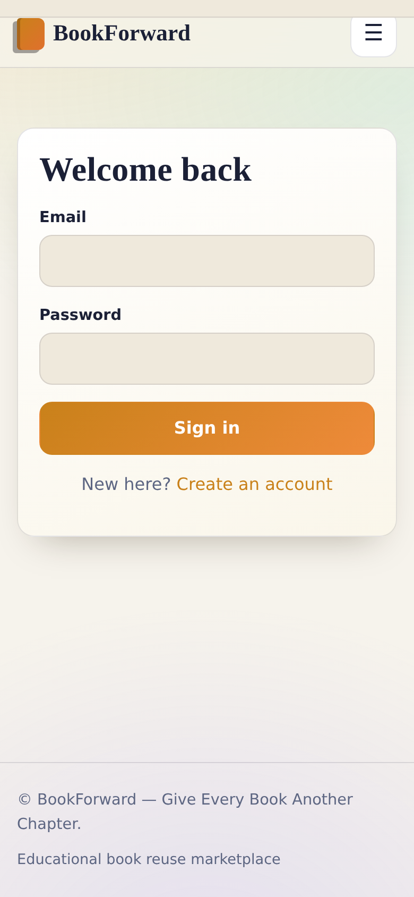 |
| 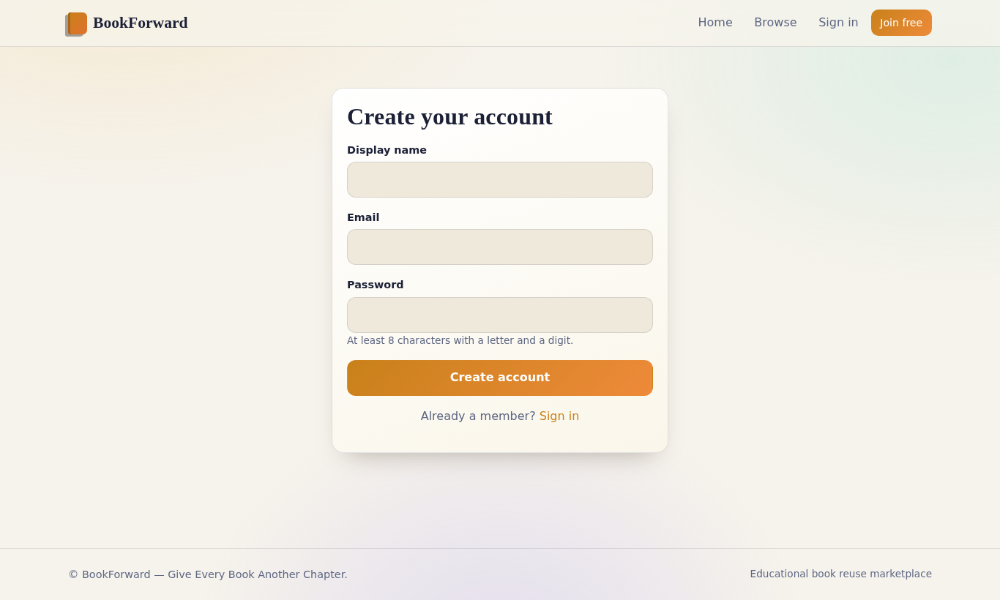 | 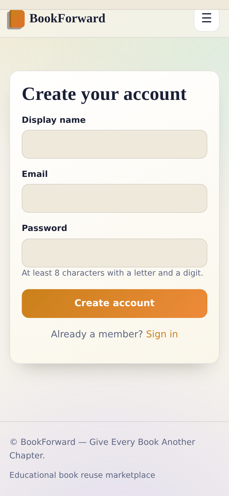 |

### Dashboard: listings, requests and orders

| PC | Phone |
|---|---|
| 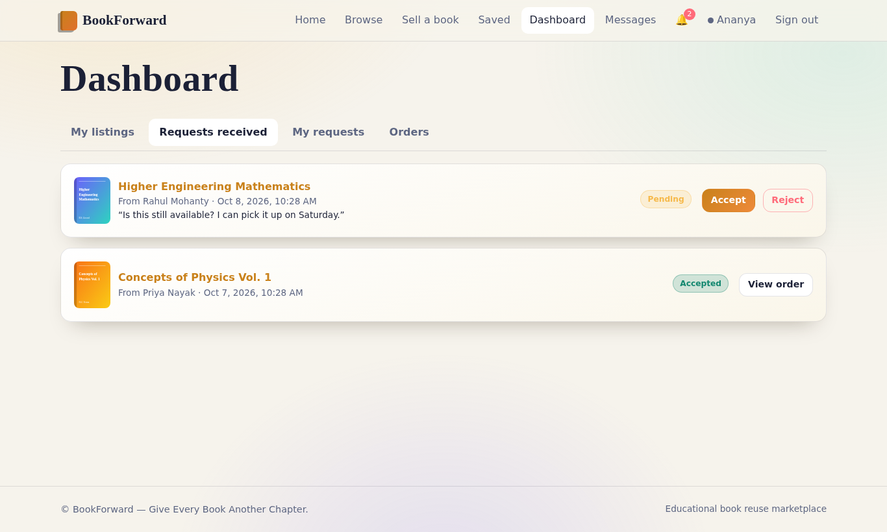 | 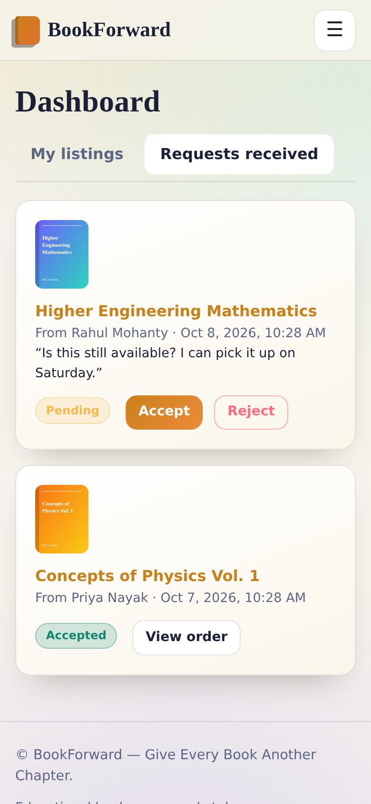 |

### Messages

| PC | Phone |
|---|---|
|  | 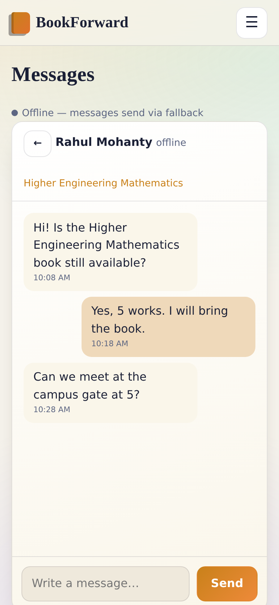 |

### Saved books, notifications and profile

| Screen | PC | Phone |
|---|---|---|
| Saved | 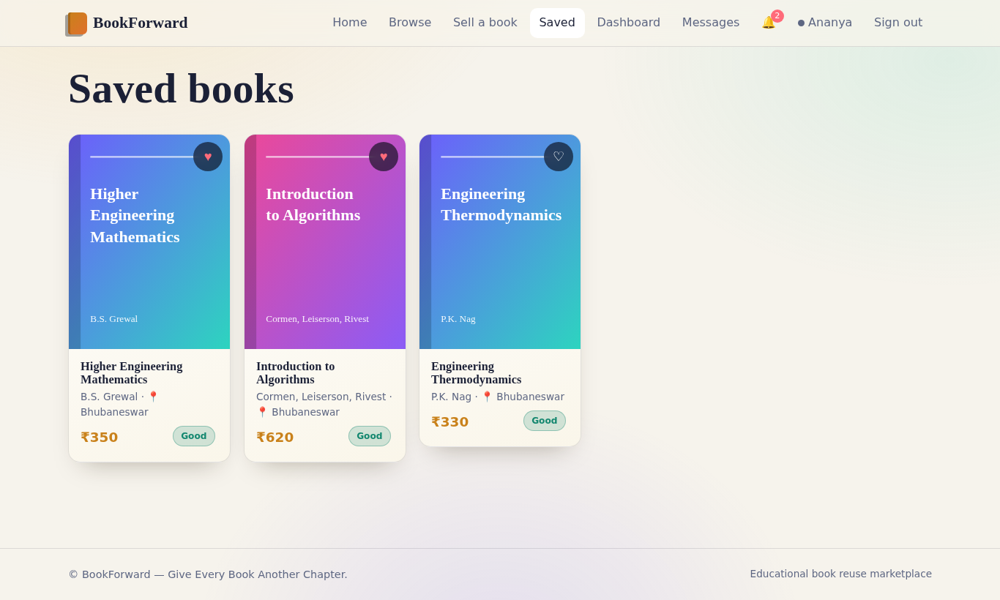 | 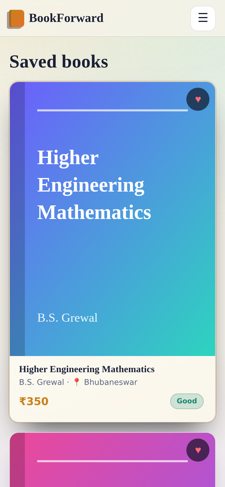 |
| Notifications | 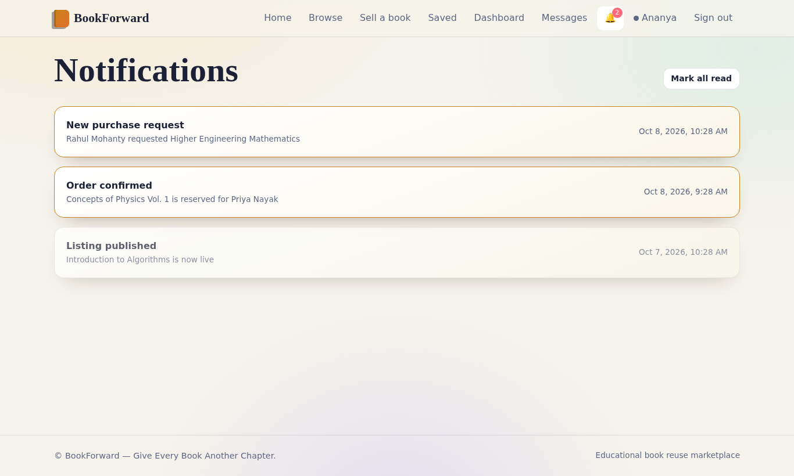 | 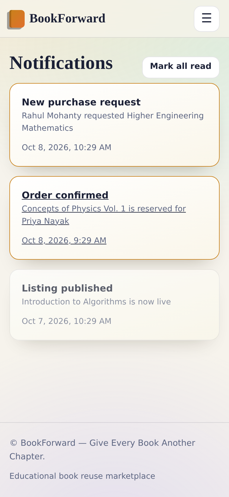 |
| Profile | 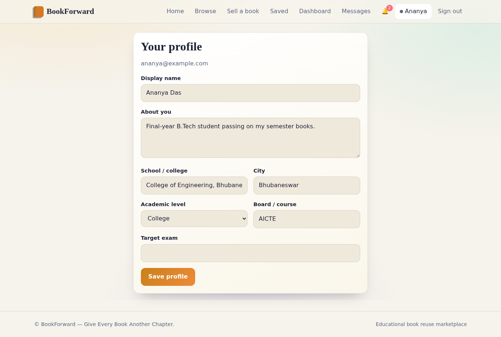 | 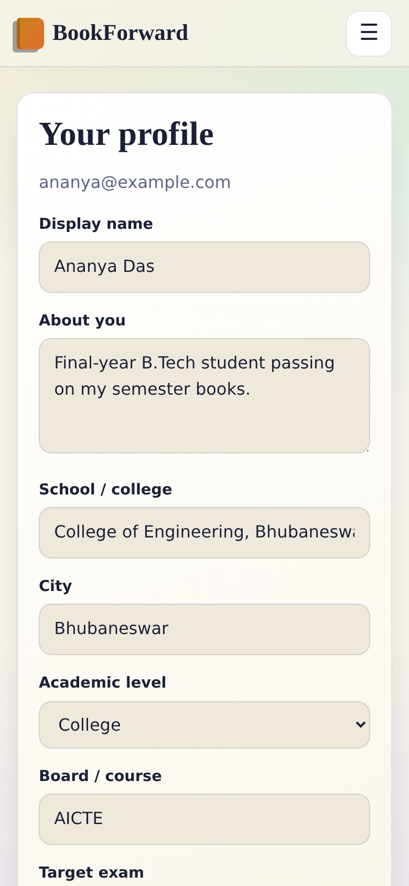 |

---

## 🧰 Tech stack

| Layer | Technology |
|---|---|
| Backend | Java 21, Spring Boot 3.3 (Web, Data JPA, Security, Validation, WebSocket/STOMP, Actuator), Flyway, JWT |
| Database | PostgreSQL 16 (Neon in production) |
| Frontend | Plain HTML5 / CSS3 / ES modules, hash-routed single-page app, CSS 3D hero |
| Maps and location | Browser geolocation + OpenStreetMap Nominatim (free, no API key) |
| Deployment | Docker, Render (backend and static frontend), Neon (database) |

## 🗂️ Project structure
```
backend/            Spring Boot app (controllers, services, entities, Flyway migrations)
frontend/           Static single-page app (index.html, css/, js/, js/pages/)
screens/            Screenshots used in this README (PC and phone)
database/  docs/  scripts/  tests/  docker/  .github/
Dockerfile          Backend image
docker-compose.yml  Postgres + backend + frontend
.env.example        All configuration variables
```

## 🚀 Run it locally
```bash
cp .env.example .env        # set DB_PASSWORD and JWT_SECRET (32+ characters)
docker compose up --build   # frontend http://localhost:5173 · API http://localhost:8080
```
If the API is not on `http://localhost:8080`, edit `apiBase` in `frontend/env.js`.

## ☁️ Deploy (Render + Neon)
1. **Neon:** create a free Postgres project and use the **direct** host (without `-pooler`).
2. **Backend (Render Web Service, Docker):** set `DB_URL` (`jdbc:postgresql://<host>/<db>?sslmode=require`), `DB_USERNAME`, `DB_PASSWORD`, `JWT_SECRET`, `SERVER_PORT=10000`, `FRONTEND_ORIGIN`, `WS_ALLOWED_ORIGINS`.
3. **Frontend (Render Static Site):** publish directory `frontend`, with `frontend/env.js` pointing at the backend URL.
4. Set `FRONTEND_ORIGIN` and `WS_ALLOWED_ORIGINS` to the frontend URL, then redeploy the backend.

To run the frontend against your own local backend, change `apiBase` in `frontend/env.js` back to `http://localhost:8080`.

**Free-tier notes:** the server sleeps after about 15 minutes of inactivity. Uploaded photos are stored on the server disk, which free Render resets on restart, so for a permanent setup move photos to cloud storage such as Cloudinary or S3.

## 🔐 How it works
- Sign-in uses JWT tokens with BCrypt-hashed passwords; roles are `USER`, `MODERATOR` and `ADMIN`.
- Publishing a listing needs a front-cover photo; uploads are checked for size, file type and real file content.
- A request moves `PENDING → ACCEPTED | REJECTED | CANCELLED`. Accepting reserves the book and creates an order.
- An order moves `CONFIRMED → HANDOVER → COMPLETED` (or `CANCELLED`). Only the buyer of a completed order can leave a review.
- **Privacy:** buyers see a listing's area, city, state and pincode. The flat or house number and exact coordinates are visible only to the seller.
- Moderators can review reports and hide listings; admin actions are logged.

## 🧭 Roadmap
Cloud photo storage, email notifications, a real payment gateway, a map view of listings, and integration tests.

## 📄 License
See [LICENSE](LICENSE).
